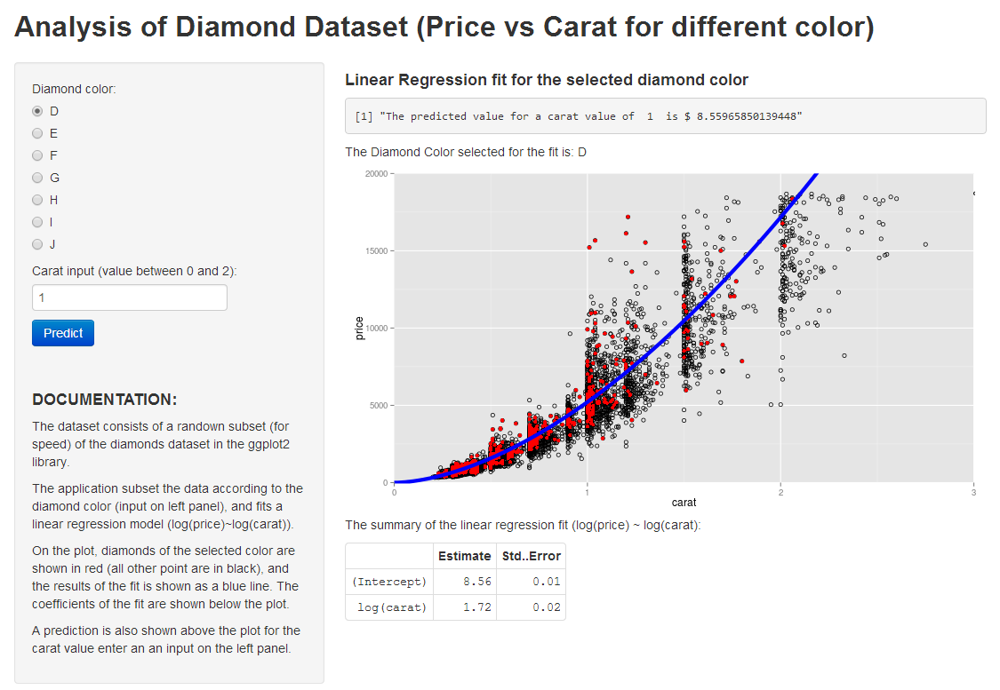

Predicting the price of diamonds based on their carat and color
========================================================
author: MC
date: 21 September 2014
transition: rotate
font-family: 'Times New Roman'

<style type="text/css">

  body {background-color:LightGoldenRodYellow }
  p    {font-size:80%; color:darkgreen}
  
</style>

Introduction
========================================================

This shiny app predicts the relationship between the price and the carat for diamonds of different colors.  

Here's a link to the app: [Diamonds_app](https://mcouillard.shinyapps.io/MCapp/)  
and a screenshot:



ui.R
========================================================

This file produces the user interface.  It displays a side panel on the left, which includes the two inputs:  

1. diamond color (D, E, F, G, H, I, or J)
2. carat value

the side panel includes the documentation for the app.

The user interface also includes a main panel, which displays the outputs (from top to bottom):

1. The prediction for the diamond price based on the two inputs.
2. A plot of the price vs carat, displaying the diamonds with the selected color (red points), the other diamonds (black circles), and the result of the linear regression fit (blue line).
3. A table displaying the coefficients of the fit.


Computation
========================================================
We first select the diamonds with the color specified as an input.  As an examples (for a diamond color: D)


```r
  dselect <- dsmall[(dsmall$color == "D"),]
```

We then perform a linear regression fit (log(price)~log(carat)) on the subset with the selected color, and we return the coefficients as follow:

```r
  modelP <- lm(log(price)~log(carat), dselect)
  summary(modelP)$coef[,1:2]
```

```
            Estimate Std. Error
(Intercept)    8.583    0.01453
log(carat)     1.774    0.02003
```


server.R
========================================================
This file has two main components.  The 1st is the model:


```r
  modelP <- function(x){
    out = lm(log(price)~log(carat), x); 
    return(out)
  }
```


The 2nd component shinyServer() takes the two inputs, and computes the outputs.  e.g. for price prediction:


```r
    output$mpgId <- renderPrint({
      dselect <- dsmall[(dsmall$color == input$dcol),]
      M1=modelP(dselect)
      price_pred <- predict(M1, data.frame(carat=input$carat))
      paste("The predicted price for a carat of ", input$carat, " is $", price_pred)
    })
```
